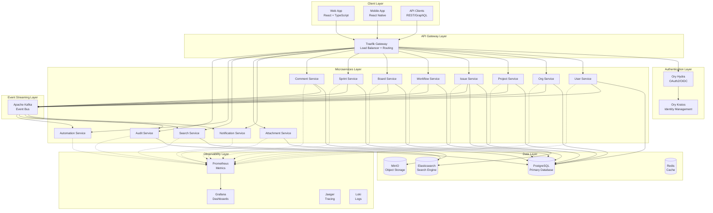

# NexusFlow Architecture Overview

## System Architecture

NexusFlow is built as a modern, cloud-native microservices architecture designed for scalability, resilience, and maintainability.

## High-Level Architecture

## Core Principles

### 1. API-First Design

- Every feature is accessible via public REST and GraphQL APIs
- Internal services communicate via gRPC for performance
- WebSocket support for real-time updates
- Comprehensive API documentation auto-generated from protobuf

### 2. Event-Driven Architecture

- All state changes publish events to Kafka
- Services react to events asynchronously
- Enables loose coupling between services
- Supports eventual consistency where appropriate

### 3. Multi-Tenancy

- Organization-level data isolation
- Row-level security in PostgreSQL
- Tenant context propagated through all layers
- Shared infrastructure with isolated data

### 4. Scalability

- Each service scales independently
- Stateless service design
- Horizontal scaling via Kubernetes
- Database connection pooling and caching

### 5. Observability

- Distributed tracing with OpenTelemetry
- Metrics collection with Prometheus
- Centralized logging with Loki
- Real-time dashboards with Grafana

## Communication Patterns

### Synchronous Communication

- **External APIs**: REST + GraphQL via Traefik
- **Internal APIs**: gRPC with Protocol Buffers
- **Real-time**: WebSocket connections for live updates

### Asynchronous Communication

- **Event Publishing**: Services publish domain events to Kafka
- **Event Consumption**: Services subscribe to relevant topics
- **Notification Delivery**: Email, Slack, webhooks triggered by events

## Data Management

### Database Strategy

- **PostgreSQL**: Primary data store for all services
- **Multi-tenant Schema**: Organization ID on all tables
- **Connection Pooling**: pgx with configurable pool sizes
- **Migrations**: Managed per service on startup

### Caching Strategy

- **Redis**: Session data, frequently accessed data
- **Application-level**: In-memory caching where appropriate
- **Cache Invalidation**: Event-driven cache updates

### Search Strategy

- **Elasticsearch**: Full-text search for issues, projects, users
- **Indexing**: Real-time via Kafka events
- **Query Language**: JQL-like syntax for advanced queries

### File Storage

- **MinIO**: S3-compatible object storage
- **Attachments**: Issue attachments, avatars, project files
- **Thumbnails**: Auto-generated for images
- **Presigned URLs**: Secure temporary access

## Security

### Authentication & Authorization

- **OAuth2/OIDC**: Via Ory Hydra
- **Identity Management**: Ory Kratos for self-service flows
- **JWT Tokens**: For API authentication
- **RBAC**: Role-based access control at org and project levels

### Data Security

- **Encryption at Rest**: PostgreSQL + MinIO encryption
- **Encryption in Transit**: TLS for all external communication
- **Secrets Management**: Environment variables + Kubernetes secrets
- **Audit Logging**: Immutable audit trail for all actions

## Deployment

### Container Orchestration

- **Kubernetes**: Production deployment platform
- **Helm Charts**: Declarative configuration
- **ArgoCD**: GitOps-based continuous deployment
- **Namespace Isolation**: Per-environment namespaces

### Service Mesh (Future)

- **Istio**: Traffic management, security, observability
- **mTLS**: Service-to-service encryption
- **Circuit Breaking**: Resilience patterns
- **Canary Deployments**: Gradual rollouts

## Performance Targets

- **API Latency**: p95 < 400ms for external calls
- **Throughput**: 1000+ requests/second per service
- **Database**: < 50ms query time for 95% of queries
- **Search**: < 200ms for full-text search
- **Real-time**: < 100ms WebSocket message delivery

## Disaster Recovery

- **Database Backups**: Automated daily backups
- **Point-in-Time Recovery**: PostgreSQL WAL archiving
- **Multi-Region**: Support for multi-region deployment
- **Failover**: Automated failover for critical services

## Future Enhancements

- **GraphQL Federation**: Unified GraphQL gateway
- **Service Mesh**: Istio for advanced traffic management
- **Multi-Region**: Active-active multi-region deployment
- **AI/ML Integration**: Smart suggestions, automation
- **Mobile Offline**: Offline-first mobile apps
